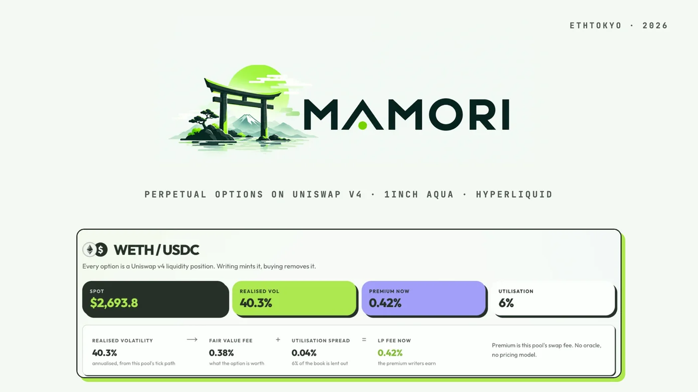
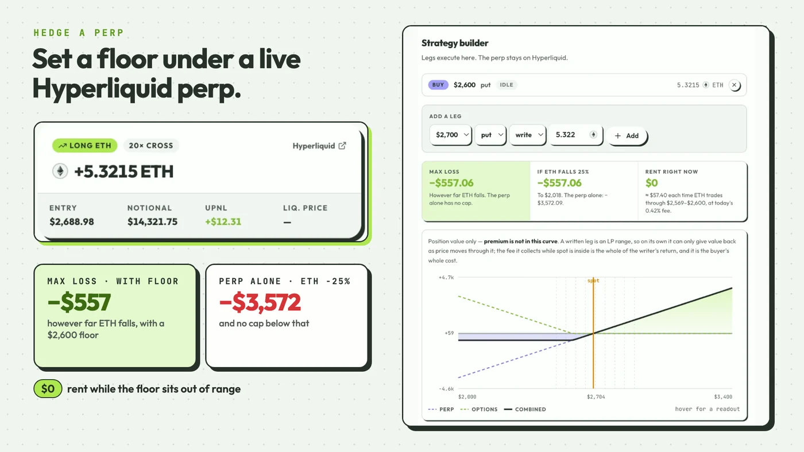
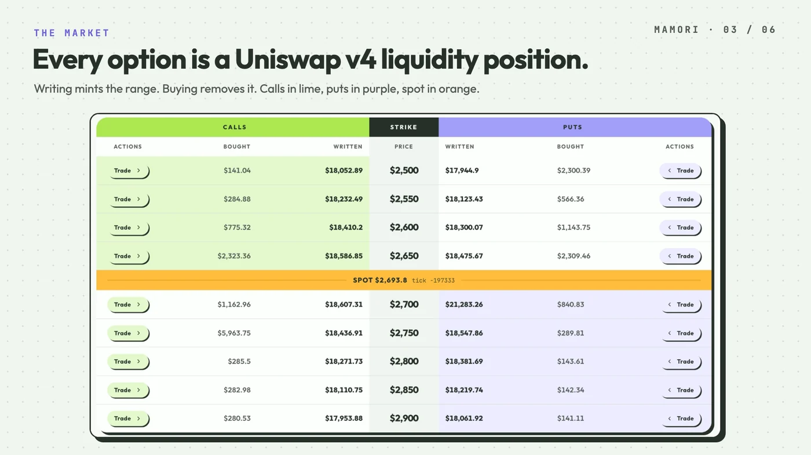
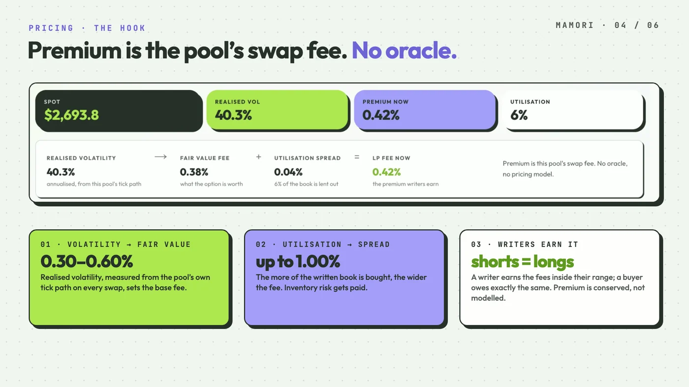
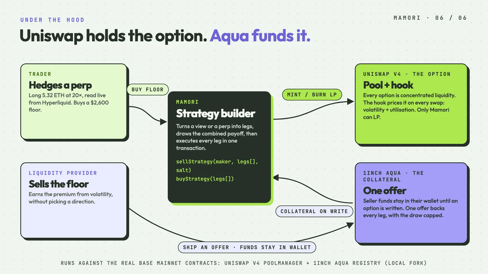

# Mamori

**Set a floor under your perp.**

*Mamori* (守り) is Japanese for protection — which is what an options book is for, and what the
torii in the mark stands over.

Perpetual options, minted as Uniswap v4 liquidity. Premium is the pool's own swap fee, so there is
no oracle and no pricing model. Seller collateral is a 1inch Aqua balance that never leaves the
seller's wallet until an option is actually written.

| | |
|---|---|
| **Live app** | <https://mamori-tokyo.vercel.app> |
| **Base mainnet** | manager [`0x9ee7aE8f…646d7`](https://basescan.org/address/0x9ee7aE8f40D100784863B507c247730A4ed646d7) · hook [`0x917c7a6b…5cA80`](https://basescan.org/address/0x917c7a6b6b4F64e287F545033839AaBa70B5cA80) |
| **Demo fork** | chain 31337 at <https://fork.astraeon.in> — seeded book, faucet, live price |
| **Tests** | 54, including a suite against the real deployed Base contracts |

Built for ETHTokyo. The network selector in the app switches between the two; testnet is the
default, because it is the one with a faucet and a book already on it.

---

## What it does

A perp trader has two ways to manage downside, and both are bad. A stop-loss gets filled at the
bottom of a wick. Lower leverage gives up the upside.

Mamori adds a third: **put a floor under the position and keep it**. Below the floor, the option
gains what the perp loses. Above it, nothing changes.

Two things make it unlike an options desk:

- **It costs nothing while it is not working.** Premium here is a fee on swaps through the option's
  price range. A floor below spot is out of range, so it accrues exactly zero — you pay when the
  protection is actually being used, not up front for something that may expire worthless.
- **It never expires.** There is no expiry date to roll, because there is no expiry at all.



The Strategies tab reads a wallet's live Hyperliquid perps and builds cover against them here. It
draws the combined payoff — perp, options, and the two together — before anything is signed, and
says plainly what the worst case becomes and what the position costs to hold.

The other side of the same market is writing that protection: earning the premium volatility
produces, without taking a direction.

---

## The idea

**A concentrated liquidity position already has the payoff shape of a short option.**

An LP holding USDC in a narrow range just below spot behaves exactly like someone who sold a put at
that price:

| Concentrated LP | Short put |
|---|---|
| Holds USDC while price stays above the range | Holds premium, unassigned |
| Earns swap fees | Collects premium |
| Converts to ETH if price falls through the range | Gets assigned the underlying at the strike |

Mirror the range above spot and you have a short call. So:

- **Writing an option = minting concentrated liquidity at that strike.**
- **Buying an option = removing that liquidity**, which hands the buyer the inverted payoff.

No separate options order book, and no separate liquidity to bootstrap. Assignment needs no
settlement code at all — it falls straight out of Uniswap's range mechanics: withdraw a position
whose price has crossed, and you receive the other asset.

Because a long is an *existing* position handed over rather than new capital sourced, the buyer
posts about **10%** of notional (`test_buyOption_removesLiquidityAndCostsTenPercent`).



Nine fixed round-dollar strikes, chosen once and baked into the deployment rather than derived from
whatever spot happened to be — so a strike is a shared reference point instead of a per-deployment
accident. See [`script/StrikeLadder.sol`](script/StrikeLadder.sol).

This is not a novel discovery on its own — Panoptic runs a version of it live. The new part is
combining it with Aqua's registry model, so the *seller's capital* is recycled too.

---

## Premium is the pool's swap fee

Premium is not quoted, oracle-derived, or fitted to an IV surface. It is the pool's own
`feeGrowthInside` over the option's tick range — actual fees paid by actual swappers:

```
premium(position) = (feeGrowthInside_now − feeGrowthInside_at_open) × liquidity / 2¹²⁸
```

A short **earns** it. A long **owes** it — rent for having pulled that liquidity out of the pool.
The two net out exactly, and that identity is asserted in `test_premiumConservation`.

The consequence worth understanding: **there is no theta.** A written option two strikes away from
spot does not decay in the writer's favour, it earns nothing at all until price arrives. The mirror
is just as sharp, and it is what makes the product work — a bought option whose range spot is
nowhere near costs nothing to carry.



The hook sets that fee per swap, using the decomposition an options desk actually uses — **fair
value from volatility, then a spread from inventory**:

```
fee = volFee                          + (MAX_FEE − volFee) × bought / written
    = 0.30%…0.60% from volatility       widened to at most 1.00% by utilisation
```

**Volatility is realised, measured from the pool's own tick path.** A tick *is* log-price, so a tick
delta is already a log return — no logarithm is needed anywhere, just an EWMA folded into one packed
storage slot per swap. Sampling happens *before* the swap executes, so a swap can never quote itself
a fee from its own impact.

**Utilisation** is pushed by OptionsManager on every open-interest change, so the swap path stays a
single storage read. At zero measured volatility the formula collapses exactly to the old
utilisation-only curve, which is why every pre-existing utilisation test passed unchanged when
volatility was added.

Measured, not asserted — the tests print these:

| | realised vol | LP fee |
|---|---|---|
| Same round trip every 10 min | 4.6% | 0.31% |
| Same round trip every 5 s | 371% | 0.60% |
| …then fully lent out | — | 1.00% |

```bash
forge test --match-test "test_vol_" -vv
```

---

## How the three pieces fit



<details>
<summary><b>Uniswap v4 — the pool is the market, and the hook is the pricing</b></summary>

Every option is a `poolManager.modifyLiquidity()` call on the real Base PoolManager
`0x498581fF…`. Not a wrapper, not a fork of the maths.

| Piece | Where |
|---|---|
| `modifyLiquidity` mints/burns every option | [`src/OptionsManager.sol`](src/OptionsManager.sol) `_modify` |
| `unlock` / `unlockCallback` flash accounting | `unlockCallback`, `_netOut` |
| `StateLibrary.getFeeGrowthInside` is the premium | `accruedPremium` |
| Dynamic LP fee set per swap | [`src/OptionsHook.sol`](src/OptionsHook.sol) `beforeSwap` |

The hook does two things, and the second is the substantive one:

1. **`beforeAddLiquidity` / `beforeRemoveLiquidity` — liquidity is options-only.** Only
   OptionsManager may be an LP, which turns "every unit of liquidity here is a written option" from
   a convention into an enforced invariant. That is what makes `feeGrowthInside` over a range
   attributable entirely to writers.
2. **`beforeSwap` — the fee is the premium.** The pool is declared `DYNAMIC_FEE_FLAG`, and the hook
   returns the fee with `LPFeeLibrary.OVERRIDE_FEE_FLAG`.

OptionsManager is an ERC-1155 that batches every mint, burn and settlement into a single
`unlock`/`unlockCallback` round trip, so v4's flash accounting stays atomic across a whole multi-leg
structure written in one transaction.

Verify it against mainnet state: `forge test --match-contract AquaFork` asserts `getPositionInfo()`
on the real PoolManager returns the exact liquidity we minted.

*Simplifications:* volatility and utilisation are both market-wide rather than per-strike, so there
is no smile. Volatility is realised, not implied. The estimator is manipulable in principle —
bounded by the EWMA's 1/8 weight per observation, a 400% cap per sample, and the fact that a
manipulator pays the higher fee they just created, to the writers.

</details>

<details>
<summary><b>1inch Aqua — the seller's capital never leaves their wallet</b></summary>

Aqua is **not** a swap venue, so it does not overlap with Uniswap at all. Uniswap is where the
option lives; Aqua is where the collateral lives. A maker "ships" a strategy that registers a wallet
balance as backing; the tokens never move until the app actually pulls them.

**The reason it matters is multi-leg.** An Aqua strategy here is scoped to the **market**, not to a
series:

```solidity
struct AquaStrategy { address maker; address app; bytes32 salt; }
```

That one decision is the whole argument. If the hash included strike and side, one shipped balance
would back exactly one series, and a four-leg structure would need four offers and four times the
committed capital — a vault with extra steps. Market-scoped, a single untouched wallet balance backs
every leg, and Aqua caps total draw at the registered amount, so the seller's worst case is one
number no matter how many legs they run.

`sellStrategy(maker, legs[], salt)` writes a whole structure atomically from that one offer, and is
callable by anyone, because shipping the offer *is* the maker's commitment. Proven in
`test_aqua_oneBalanceBacksAMultiLegSpread`, `test_aqua_oneOfferBacksATwoCurrencyStrangle` and
`test_aqua_strategyCannotOverdrawTheOffer`.

**An offer is a quote, not a balance.** Aqua strategies are immutable: a shipped
`(maker, app, strategyHash)` can never be shipped again, so there is no such thing as topping an
offer up. That shapes the UI more than anything else in this integration — salts are an indexed
series that the frontend scans, and `collateralFor()` quotes what a write will pull by mirroring
`Pool.modifyLiquidity` exactly, because an offer one wei short is an offer that has to be abandoned.

</details>

<details>
<summary><b>Hyperliquid — positions in, structures out</b></summary>

Read-only, and deliberately so. We do not trade on Hyperliquid, hold keys, or sign anything there.
Hyperliquid is a **position source**: the Strategies tab reads a wallet's live perps from the public
`clearinghouseState` endpoint, then offers structures on *this* market that act on that exposure.

| Piece | Where |
|---|---|
| Read-only proxy, two endpoints allow-listed | [`app/api/hyperliquid/route.ts`](frontend/app/api/hyperliquid/route.ts) |
| Position parsing + strategy templates | [`lib/strategies.ts`](frontend/lib/strategies.ts) |
| Builder, payoff curve, execution | [`components/strategy-builder.tsx`](frontend/components/strategy-builder.tsx) |

Written legs execute as **one `sellStrategy` call funded from a single Aqua offer** — which is where
the three sponsors meet in one transaction: a Hyperliquid position motivates it, Aqua funds it,
Uniswap v4 holds it. Bought legs batch too, for a different reason: a spread that fills its long leg
and then fails on the short one leaves the trader holding naked exposure they never asked for.

**An honest labelling.** A covered call is *not* a hedge against a perp — writing a call here means
posting WETH, and a perp is not deliverable inventory. Those structures are still offered because
people want them, but they are tagged `yield` and state the inventory they need. The genuine perp
hedges are the bought legs.

**You can only buy what someone wrote.** A long is written liquidity removed from the pool, so a
strike with no short behind it cannot be bought at any price. The builder reads each bought leg's
remaining depth, caps it with one click, and blocks execution rather than letting a doomed structure
reach the wallet.

</details>

---

## Run it

Requires Foundry and Node 18+.

```bash
forge install && forge test
```

Then four terminals, in this order — each one stays running:

```bash
./demo/anvil.sh                      # 1. fork Base
```
```bash
./demo/setup.sh                      # 2. deploy, seed the ladder, fund demo accounts
```
```bash
cd frontend && npm install && npm run dev    # 3. the app, on :3000
```
```bash
./demo/churn.sh --loop               # 4. keep price moving so premium accrues
```

Then open <http://127.0.0.1:3000>.

`churn.sh` is worth running during a demo. A fork is frozen at the block it was made from, so
nothing swaps — and premium here IS the swap fee, so an untouched book pays its writers nothing no
matter how much is written. Each round reads the real ETH mid from Hyperliquid, walks the pool
toward it a few ticks at a time, and round-trips a small size from three throwaway accounts. The
walk is capped per round: closing a large gap in one swap would print a vertical move and peg the
volatility fee at its ceiling, which is a true reading of a fake price path.

<details>
<summary><b>Connecting a wallet</b></summary>

Add a network: RPC `http://127.0.0.1:8545` (or `https://fork.astraeon.in`), **chain id `31337`**,
currency ETH. The app's banner will offer to add it for you.

Fund yourself on the fork:

```bash
./demo/fund.sh 0xYourAddress
```

That gives 10 ETH, 500,000 USDC and 100 WETH. Use a plain EOA — an address with an EIP-7702
delegation has code on the fork and fails the ERC-1155 receiver check when a position is minted.

Or import a demo key:

| Role | Address | Key |
|---|---|---|
| Seller | `0x260529A5889B22dB02E0e8c1F90A7415084dF54E` | `0xaab17b89d7376948ee5710c0a73b05f449c86946b1bc6da38c89e0803997992f` |
| Buyer | `0x3F8bC758CBCc3bB199FC7799f96D24aeEf242999` | `0x14ab088b7dcb56ff0099d87d5eb505efa89faad5d92be065a89817cf983b8152` |

Or inspect either without connecting: `?as=0x2605…` on the Positions page.

</details>

### Tests

```bash
forge test                                  # 54 tests
forge test --no-match-contract AquaFork     # offline
```

`test/OptionsManager.t.sol` covers the mechanism against a local PoolManager;
`test/AquaFork.t.sol` runs against the **real deployed** Base contracts.

---

## What's built, and what isn't

<details>
<summary><b>Scope — the full design versus this build</b></summary>

There is a larger design document behind this project. Almost none of it is built, on purpose. This
is the one mechanism that is actually novel and actually demoable.

| Full design | This build |
|---|---|
| Multi-asset, permissionless markets | One market: WETH/USDC on Base |
| Full strike/expiry surface | Nine fixed strikes, $2,500–$2,900, puts and calls |
| Streamia accumulator, IV-aware pricing floor | Premium = real `feeGrowthInside`. No oracle, no model. |
| ERC-1155 encoding pool/strike/direction/width | **Built** — [`src/libraries/PositionId.sol`](src/libraries/PositionId.sol) |
| Aave yield-stacked ERC-4626 collateral vaults | **Not built.** Collateral is Aqua-registered, not deposited. |
| Aqua as part of the collateral stack | **Aqua _is_ the collateral mechanism** |
| Buyer leverage via protocol-borrowed liquidity | **Built** — buyer posts ~10% |
| Flash-loan liquidation bots, insurance fund, ADL | **Not built.** `liquidateLong` is a manual button. |
| Hyperliquid hedge **vault** (protocol trades perps) | **Not built.** What is built is read-only. |
| Median-TWAP solvency, OI caps, geofencing, audits | **Not built.** |

</details>

<details>
<summary><b>Known simplifications, stated plainly</b></summary>

These are marked in the code where they occur, not buried here:

- **A long's loss is not strictly capped at its collateral.** Premium accrues in both currencies, but
  a single-sided option posts collateral in only one, so closing settles any deficit from the wallet.
  Production would value collateral across both legs and margin-call first.
- **`liquidateLong` is a stand-in**, not liquidation infrastructure. No bonus, no partial
  liquidation, no bad-debt socialisation.
- **Position accounting is keyed by `(owner, tokenId)`.** The ERC-1155 is a receipt; transferring it
  does not move the underlying accounting.
- **An Aqua strategy encodes no minimum premium**, so a matcher picks the moment of execution.
  Production would sign a price band into the strategy bytes.
- **A floor caps P&L, not margin.** It pays out here, on Mamori — it does not add margin on
  Hyperliquid, so a wick can still liquidate the perp. Keep the liquidation price below the floor.

</details>

<details>
<summary><b>Notes from the build</b></summary>

Things that cost real time and are worth knowing if you build on this stack:

- **Aqua has no testnet.** It is deployed on 17 mainnets, all at
  `0x1111113CCf1426A8E30e2bfF5E005d929bF6a90a`, and nowhere else. Forking a mainnet is the only way
  to integrate against the real contract — which is better than a testnet mock anyway.
- **v4 hook addresses encode their permission flags**, so the address has to be brute-forced before
  deploying. `HookMiner` searches against Foundry's CREATE2 deployer proxy.
- **`BaseHook` no longer exists in v4-periphery** (removed in `5da22e60`). `OptionsHook` implements
  `IHooks` directly against v4-core instead.
- **Anvil's default accounts all carry EIP-7702 delegations on Base mainnet.** Their keys are public,
  so someone has delegated every one of them. On a fork they therefore have code, behave like
  contracts, and fail ERC-1155 receiver checks. The demo uses freshly derived accounts.
- **Do not give a fork the real chain's id.** It is tempting, because addresses then look "right",
  but MetaMask recognises a mainnet id and stops asking the node for gas estimates — it sends a gas
  limit around 45,000 for a call that needs ~430,000. Every write reverts out-of-gas while reads keep
  working perfectly. Using 31337 also lets wagmi detect a wrong-network wallet at all.
- **Two forks of Base are indistinguishable by chain id.** Both answer to 31337, so a wallet pointed
  at the wrong one passes every mismatch check and lands its transactions somewhere the app will
  never look. The app compares the manager's *bytecode* instead — same address, different immutables.

</details>

### Not a perps replacement

This is explicitly **not** pitched as better than perps. Perps will keep dominating retail crypto
trading for structural reasons: one instrument, one deep venue, no strike/expiry complexity to learn.

It is pitched as a **capital-efficient hedging and volatility-selling instrument for people who
already trade**, enabled by two pieces of infrastructure that did not exist when Hegic, Opyn, Dopex,
Premia, Lyra and Ribbon each failed to reach scale: Uniswap v4 hooks, and Aqua's registry model.

---

## Layout

```
src/
  OptionsManager.sol        core mechanism: write, buy, close, premium, Aqua funding
  OptionsHook.sol           v4 hook: options-only liquidity, and the dynamic fee
  libraries/PositionId.sol  ERC-1155 id encoding
test/                       54 tests, incl. against real deployed Base contracts
script/                     deploy, seed, strike ladder
demo/                       anvil fork, one-shot setup, churn loop
infra/                      hosted fork: RPC gateway, faucet, snapshots, systemd
frontend/                   Next.js: Chain, Strategies, Positions, Faucet
```
